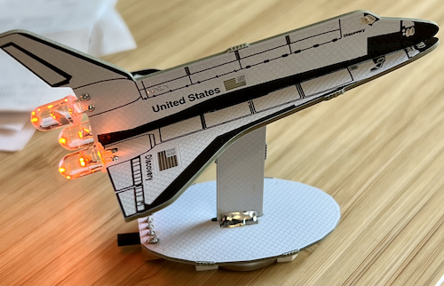

## OV-103: Discovery

The Space Shuttle Discovery was a NASA orbiter whose first mission was in 1984. A few interesting statistics about the shuttle.

- 39 completed flights
- Over 238,000,000 km traveled
- 8,783 flight hours
- 5,830 orbits around Earth completed

## Soldering

I picked up this soldering kit from the wonderful people over at Adafruit, the kit was designed and built by Phyx. The instructions provided on the product page for
Adafruit are very helpful, pay attention to the polarity indicators on the PCB components and be sure you've dialed in your soldering iron to the appropriate temp. For my 63Sn/37Pb leaded no clean solder
I used ~725 degrees Fahrenheit via my Hakko FX-888D. I will say that it was particularly disconcerting when I bent the LED leads at 90 degree angle, however there is a flat section of the leads that makes it easier.

Don't forget to review the assembled picture online to get a sense for the appropriate layout of each component. Soldering the large joints at the stand base and where the stand connects to the shuttle took a bit more heat and solder obviously to get a solid joint established.

## Testing

I have a multimeter which was handy to verify connectivity between soldered connections. In addition you can simply turn the device on and verify that the LEDs are powered and flickering.

### References

- [Design By Phyx](https://phyx.be/STS/)
- [Adafruit Product](https://www.adafruit.com/product/5414)
- [Wikipedia](https://en.wikipedia.org/wiki/Space_Shuttle_Discovery)
- [NASA OV-103](https://www.nasa.gov/centers/kennedy/shuttleoperations/orbiters/discovery-info.html)
