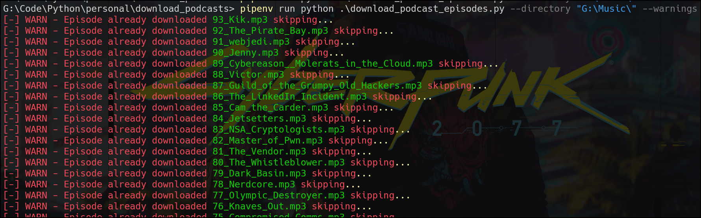

I use the Pocket Casts app to download a few podcasts I listen to, however I also wanted to download and keep all the episodes from some of these podcasts as an archive if you will on my machine. Space is limited on my phone where I do most of my podcast listening but I've got ample space on my primary machine.

Thus I wrote a small python podcast downloader that takes the RSS URL, parses the feed and its entries, identify the actual download link and downloads to a directory of my choosing if the episode isn't already downloaded.

A few packages that I found super useful when writing this are:

- rich
- feedparser
- requests
- pathlib
- argparse

`argparse` and `pathlib` are part of the standard library but Rich, Feedparser and Requests you'll have to install.

## Install dependencies

```shell
poetry add feedparser
poetry add rich
poetry add requests
poetry install
```

## Example run

```shell
poetry run python .\download_podcast_episodes.py "C:\Podcasts\"
```

Example output if you enable warnings just to verify you've already got files downloaded.




